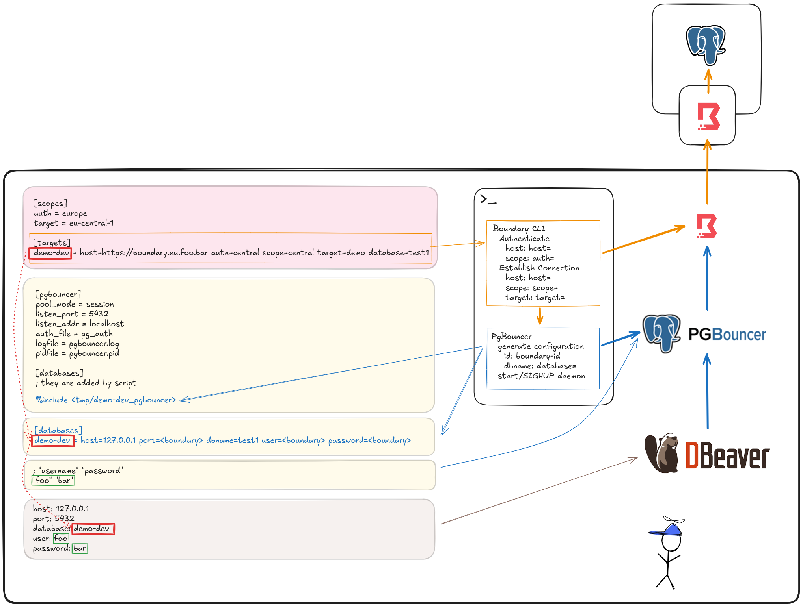

# PgBoundary - A wrapper around `boundary` and `pgbouncer` CLI for integration into IDE/database tooling

This is a simple wrapper around the `boundary` and `pgbouncer` CLI tools.

## Integration into IDE/Database tooling

This project is for a specific use case

- You have an internal PostgreSQL database
- You connect to it via HashiCorp Boundary
- You are using OIDC for AuthZ and AuthN
- You are using HashiCorp Vault integration in Boundary to provide dynamic credentials
- You want to use this setup from an IDE or other database tooling

### Idea
For each session, Boundary provides a triplet of dynamic information - `username`, `password` and localhost:`port`

Using a local [PgBouncer](https://www.pgbouncer.org/) postgres proxy, the connection settings for your tooling can be
stable while the dynamic portions of Boundary are hidden.

1. Boundary connection to an environment is established (via CLI)
2. Connection details are written into PgBouncer format
3. PgBouncer is started/reloaded
4. IDE connects through PgBouncer



### Boundary Introduction

Boundary CLI and Desktop clients are available here: https://developer.hashicorp.com/boundary/install

Boundary has the concept of `Scopes` and `Targets`.

#### Scope

Scopes are used to define areas inside Boundary and are used for **Authentication** and for selecting **Targets**.

These 2 scopes will most likely NOT be the same and can be set in the `pgboundary.ini` either as defaults (`[scopes]`) or per `[target]`.

#### Target

A target is a configuration item inside Boundary defining to which entity a connection should be established and what credentials to provide.

### Setup

1. Install dependencies CLI

    - [PgBouncer](https://www.pgbouncer.org/) via [brew](https://formulae.brew.sh/formula/pgbouncer)
      ```
      brew install pgbouncer
      ```
    - [Boundary CLI](https://developer.hashicorp.com/boundary/install) via brew
      ```
      brew tap hashicorp/tap
      brew install hashicorp/tap/boundary
      ```

2. Download the latest release from the [releases page](https://github.com/sigterm-de/pgboundary/releases)  
    Or install via brew  
    ```
    brew tap sigterm-de/pgboundary https://github.com/sigterm-de/pgboundary
    brew install pgboundary
    ```

3. Copy the files `pgboundary.ini`, `pg_config.ini` and `pg_auth` to a convenient place. The binary tries to find them in the following locations:
    - `./`
    - `~/.pgboundary/`, or
    - `$XDG_CONFIG_HOME/pgboundary`

   Note: you can always specify a config file with `-c path/to/config.ini`

4. Configuration

   The configuration file (`pgboundary.ini`) consists of these main sections:

   ```dosini
   [scopes]
   ; default scopes for authentication and targets
   auth = org
   target = dev
   
   [auth]
   ; default authentication method
   method = oidc
   
   [pgbouncer]
   ; workdir is either absolute or relative to this file; holds the `conffile` and from there the `auth_file`
   ; recommendation: leave all files in 1 place
   workdir = .
   conffile = pg_config.ini
   
   [targets]
   ; standard example
   demo-dev = host=https://boundary.example.com target=demo-ro
   ; another environment
   demo-stage = host=https://boundary.stage.example.com target=demo-ro
   
   ; this is a shared RDS instance and we have to provide the database name, note the scopes for authentication (`auth`) and target (`scope`)
   demo-dev-2 = host=https://boundary.example.com auth=org target=demo-ro scope=dev database=testdb
   ```

   Each target entry consists of:
    - `host`: Boundary server URL (including https://)
    - `target`: Boundary target name
    - `auth`: (optional) Authentication scope, overrides default
    - `scope`: (optional) Target scope, overrides default
    - `database`: (optional) Database name; defaults to `target` name without "-ro" or "-rw" suffix

5. Configure your IDE/database tool:
    - Host: `127.0.0.1`
    - Port: `5432` (as configured in `pg_config.ini`)
    - Username/password: as set in `pg_auth`
    - Database: use the target name from `pgboundary.ini`

## Usage

```bash
# List available targets and active connections
pgboundary list

# Connect to a target
pgboundary connect demo-dev

# Show verbose output
pgboundary -v connect demo-dev

# Shutdown specific connection
pgboundary shutdown demo-dev

# Shutdown all connections
pgboundary shutdown

# Show version information
pgboundary version

# Show detailed version information including latest available releases
pgboundary version -v
```

### Configuration Tips

- For shared database instances, specify the database name in the target configuration
- Scopes can be set globally in the `[scopes]` section or per-target
- Use the verbose flag (`-v`) for debugging connection issues
- If `pgboundary` is in your `$PATH`, you can set it up as a connection script in your tooling
- In some IDEs you may have to set something like "Single Database Mode" (from [JetBrains](https://www.jetbrains.com/help/datagrip/2024.3/data-sources-and-drivers-dialog.html?data.sources.and.drivers.dialog#optionsTab))  
  > In the database tree view, show and enable only the database that you specified in the connection settings.  
  > When you connect to a data source, DataGrip can retrieve and display you all the databases that the data source has. But in some cases (for example, with certain settings of PgBouncer), you can or are allowed to work only with a certain database. In the database tree view with the Single database mode enabled, you see only the database that you specified in the connection settings.

## Troubleshooting

- **First of all**, use the Boundary desktop application to figure out your actual permission set. This wrapper can only provide what is already present.
- In case the boundary authentication and connection is `OK`, but pgbouncer is `NOK`, please run pgbouncer manually to get more feedback - `pgbouncer --daemon <path>/<to>/pg_config.ini`
- There might be configuration relicts in `pg_config.ini`. To purge them, please run `pgboundary shutdown` (until a dedicated command is available)

## Limitations

- only **OIDC** authentication is supported
- credentials are expected to be provided by Boundary (via Vault)

## License

MIT
